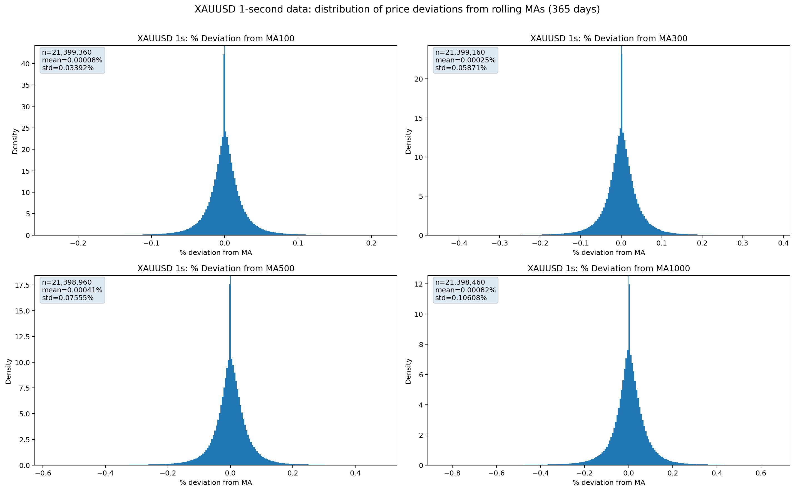
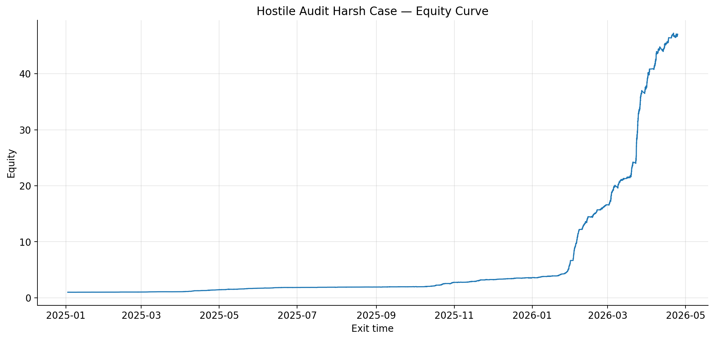
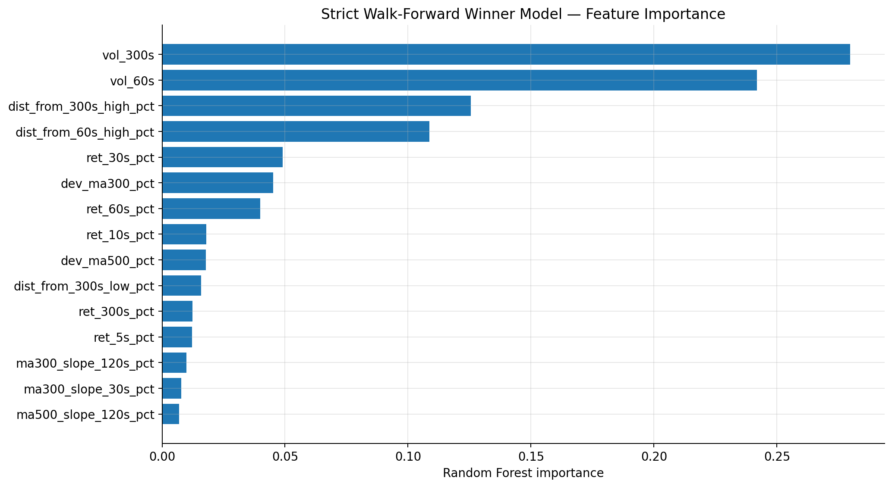
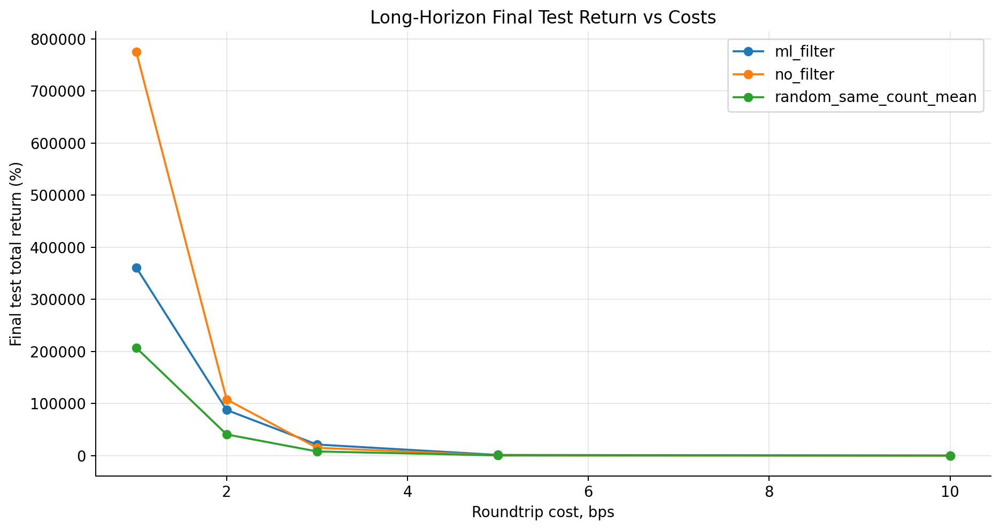

# market-microstructure-backtests

High frequency XAUUSD market data research, small timeframe deviation signals, cost aware backtests, walk forward validation, and robustness checks.

In this small project i study how gold behaves after extreme short term price deviations from rolling moving averages of the closing price data.
> **Note:** This is a small research project. Historical backtest results are not live trading claims. Execution quality, spreads, slippage, latency, broker-specific costs, and paper trading validation remain open issues.

---

## What This Project Is About

I started with a simple question:

When price compared to a fixed slow MA is an outliar from the data, far below a rolling moving average on a rather small timeframe, does it tend to rebound? 
The intuition was that significant short term deviations from a slow rolling average may contain some mean reversion behavior, but this only matters if the effect survives transaction costs and realistic exit assumptions.

To test this, I built a research pipeline around 1 second XAUUSD data. I downloaded the market data from https://www.dukascopy.com, then for time efficency purposes converted the zips into csvs then parquet, computed the rolling averages and deviation signals and looked for the distribution of the data (figure below) and interesting zones where we get a relativly high n-trades while still having a reasonable tp and safety system to not hold unrealised pnls. After finding some promising ranges, which i could read out pretty well from the heatmaps i generated i started backtesting, each backtest i went over the most promising combination as well with a small degree of randomness to increase the likelyhood of finding the best combinations. I got some very promising results with returns, the first version of the signal produced many small mean reversion trades. That looked interesting, but many small trades are very sensitive to costs and with realistic fees those strategies didnt work. After i added realistic slippage/fees the ranges and parameters chanegs a lot, as now we would need a high enugh difference between buy and sell to cover slippage and fees, so the best working combinations turned out to be the ones with relativly high n-trades while keeping the difference between buy and sell high and tighning the trade timespan and sl. Most trades were actually executed and ran for a relativly small time period of a few dozen bars so closing the trade after this timespan made the model work a lot better.

## Selected Figures

### Distribution Around Rolling Moving Averages



### Hostile Audit Equity Curve



### Feature Importance



### Cost Sensitivity



---

## Data

- **XAUUSD 1 second market data**
- high frequency OHLC style time series
- parquet based storage for faster loading and analysis (less compute time :)

The local workflow is roughly

```text
raw data -> cleaned time series -> parquet files -> feature generation -> research outputs
```

---

## Signal Research

The first part of the project studies price deviation from rolling moving averages. For Example:

- MA100-2000
- significant percentage distance from the moving average so 0,1-5% 
- future maximum rebound over a fixed horizon after setting the buy signal at this significant deviation

 For Example: If price is 0.10% below MA300, what is the distribution of the maximum rebound over the next 2,000 seconds?

---

## Sequential Backtesting

After the signal research, I converted the idea into sequential trade simulations.

The backtest includes:

- one open trade at a time
- fixed take profit (in a reasonable range)
- stop loss (in a reasonable range)
- maximum holding time (in a reasonable range)
- transaction cost assumptions (in a range from 1-25bps)
- different exit rules

Exit types tested included:

- fixed TP/SL (but a reasonable range)
- protected flexible TP (trailing tp)
- unprotected flexible TP (trailing tp without as tight safety measures)
- time based exit (so close the trade after n-seconds no matter what)

This matters because high frequency strategies can look good if the backtest is too generous. I wanted to check whether the idea still worked after making the simulation more realistic.

---

## Event Filtering

A later part of the project uses an event filtering approach

1. Generate candidate events where price deviates below the moving average.
2. Label historical events by their future rebound and drawdown.
3. Train a simple model using only information known at entry time.
4. Use the model score to filter for higher-quality candidate events.
5. Compare the filtered strategy against unfiltered and random baselines.

Entry-time features include:

- deviation from MA300 / MA500
- recent short horizon returns
- moving-average slope
- rolling volatility
- distance from recent highs/lows
- time of day features

The goal is not to magically predict the future, but to test whether some deviation events are statistically better than others before the rebound happens.

---

## Walk-Forward Validation

To reduce overfitting, I used time-based splits.

Example long-horizon setup:

- **Train:** 2023
- **Validation:** 2024
- **Final test:** 2025-2026

The model is trained on the training period. Strategy settings are selected on the validation period. The final test period is then used only after the rules are fixed.

This is important because testing and tuning on the same period can easily create misleading results.

---

## Robustness Checks

Several hostile checks are included to see whether the results depend on fragile assumptions.

- transaction costs from 1 to 10 bps
- fixed TP only
- protected flexible TP
- unprotected flexible TP
- entry delay
- exit delay
- extra slippage assumptions
- no filter baseline
- random same-count baseline
- monthly performance breakdown


---

## Tools Used

- Python
- pandas
- polars
- NumPy
- scikit-learn
- matplotlib
- Jupyter
- parquet
- R

---

```
