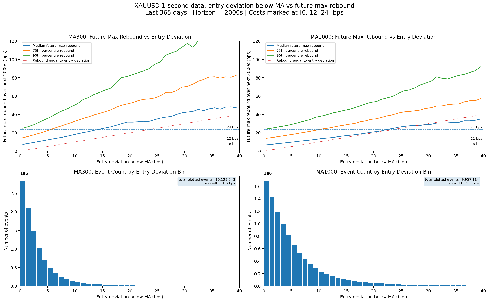
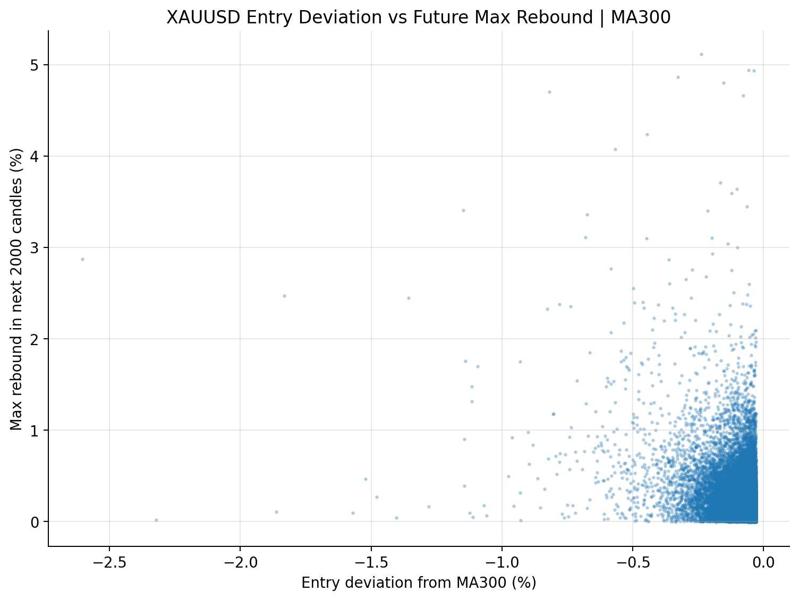
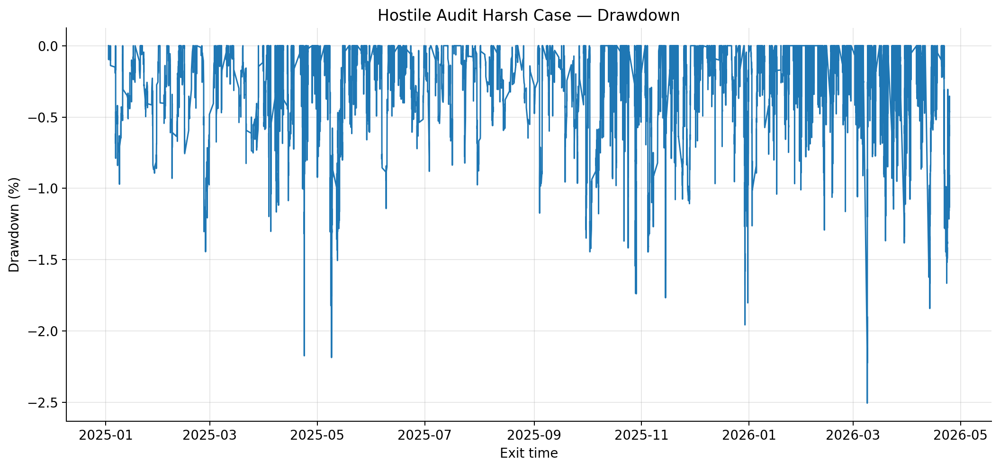

XAUUSD Intraday Mean Reversion Research
I built this project to test a simple idea on very high frequency gold data.
When XAUUSD moves unusually far below a rolling average, does it actually bounce enough to be useful after costs, delays and stricter exits?
The honest answer from this first version is mixed. There is some short term rebound behaviour in the raw data, but the setup becomes much weaker once trading frictions are added. That was the most useful result for me, because it showed where the idea breaks instead of only showing the nicest backtest curve.
This repository is a research archive. It is not a live trading system, trading advice, or proof that the strategy can be deployed.

  

Why I Looked At This
I was interested in the kind of question that looks simple on a chart but becomes much harder once you write it down as a rule.
Gold often has sharp intraday moves. Some of them fade quickly, some keep moving, and some only look attractive because the chart is already showing the rebound. So I wanted to test it more carefully. Not just "did it bounce later", but whether the bounce was large enough, frequent enough and clean enough to survive a more realistic simulation.
The main signal is intentionally simple. I compare price with rolling moving averages and look for large negative deviations. After that I measure what happened next, then I turn the better looking areas into sequential backtests.
What I Actually Did
The data starts from Dukascopy historical XAUUSD files. I cleaned it into a 1 second time series and stored it as parquet, because scanning high frequency data repeatedly becomes painful very fast if the data is not structured properly.
Dukascopy raw files
cleaned 1 second time series
parquet storage
rolling average features
deviation events
sequential backtests
diagnostic charts
The event study asks one question first.
price falls below MA300 by 0.10 percent
measure rebound and drawdown over the next 2,000 seconds
That step is useful because it shows whether the idea has any broad structure or whether it only works in a tiny, cherry picked area.
After that I tested candidate regions as trade rules. The backtest only allows one open position at a time. It includes a take profit, a stop loss, a maximum holding time, transaction costs, delayed entry checks and delayed exit checks. I also tested fixed exit and flexible exit variants, because a mean reversion idea can look very different depending on how generous the exit logic is.
The Main Thing I Learned
The signal is very cost sensitive.
Before costs, many small mean reversion trades can look interesting. After costs, slippage and stricter exits, a lot of that disappears. That does not make the project useless. For me it was actually the point. A strategy research project should not only produce a nice equity curve. It should also show what happens when the assumptions become less friendly.
The better areas were not the ones with the biggest isolated return. They were the areas with enough observations, enough room between entry and exit, and less dependence on one exact parameter choice.
Validation
I used a time split instead of randomly mixing the data. The early period was used for exploration, the middle period for validation and parameter choice, and the later period for a final check.
2023        training and exploration
2024        validation and parameter selection
2025 to 2026 final test
I also checked how the result changes under higher costs, extra slippage, entry delay, exit delay, stricter exits, an unfiltered baseline and a random same count baseline.
Selected Charts
Entry Deviation And Rebound
This chart is the starting point. It shows how future rebound changes as the entry deviation becomes more extreme. I used this to see whether the mean reversion behaviour was broad enough to be worth testing.

  

Moving Average Deviation Distribution
Before testing signals, I wanted to understand what "large deviation" even means for this instrument. This view helped me compare different moving average windows and avoid choosing thresholds blindly.

  

Stress Case Equity And Drawdown
This is not shown as proof that the strategy is ready. I mainly used it as a hostile audit view. If a setup only survives with generous assumptions, I do not trust it. The drawdown chart matters just as much as the equity line.

  
  

Cost Sensitivity
This is probably the most important chart in the repository. The headline return is not the point. The point is how quickly the result changes when round trip costs increase. For a short horizon strategy, that is one of the first things I would want to know.

  

Event Filter Diagnostic
I also tested a simple event filter using only information that would have been known at entry time. The point was not to claim stable prediction. I used it to understand which variables the model leaned on when trying to separate better and worse events.

  

What This Repo Is And Is Not
This is a public write up of the research and selected outputs. It shows the idea, the data workflow, the validation logic, the diagnostics and the main failure modes.
It is not yet a clean reproduction package. The full private research pipeline is not packaged here, and I would not present this as a deployable trading system.
The biggest limitations are clear. This is one instrument. There is no order book data. There is no live or paper trading validation. Spread, latency and fill assumptions are still simplified. Manual parameter selection also creates data mining risk, even with a time split.
Tools
Python, pandas, polars, NumPy, sklearn, matplotlib, Jupyter, parquet and R.
Continuation
This project led into a second version where I moved away from one fixed XAUUSD setup and started testing a more adaptive workflow across instruments and regimes.
